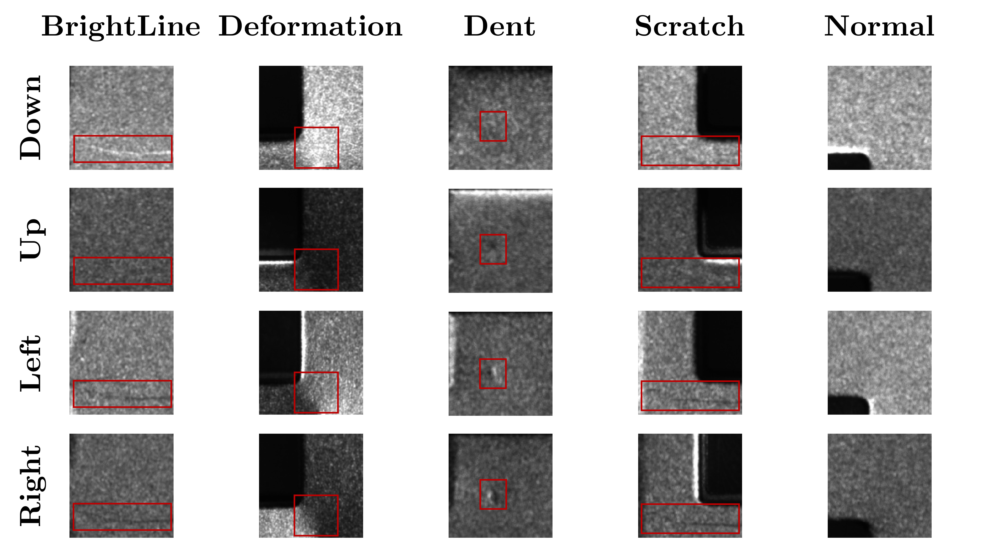
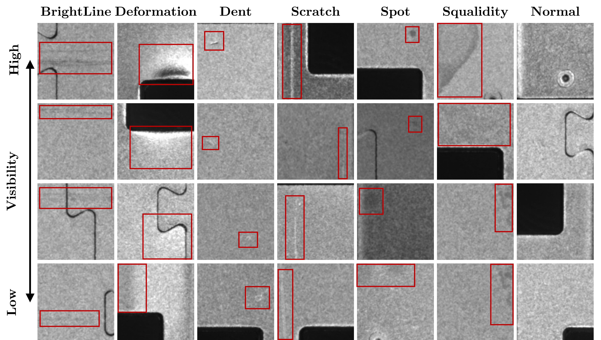
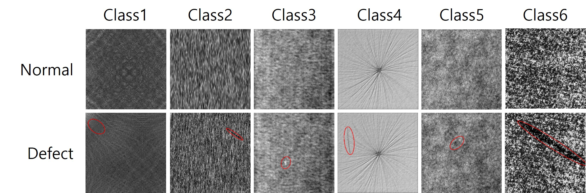

# Unknown
This paper will be disclosed when the submission is accepted (paper에 사용된 그림들 적극 활용)

Dataset

1. USB-MD

<div align="center">
    
</div>

다운로드: https://drive.google.com/drive/folders/1NvQ5vZvZMdpJN8s1ttp9ZaMZ13OgQbAa?usp=sharing

2. USB-SD

<div align="center">
    
</div>

다운로드: https://github.com/Xavierman/A-deep-learning-based-surface-defect-inspection-system-using-multi-scale-and-channel-compressed-feat?tab=readme-ov-file

6. DAMG2007

<div align="center">
    
</div>

다운로드: https://conferences.mpi-inf.mpg.de/dagm/2007/prizes.html

모든 실험은 seed=42 고정 (3회 반복 실험은 seed=42,43,44)

```
MULTI-LIGHT_SOURCE_USB-CONNECTION/
│
├── Anomaly_detection/
│   ├── __pycache__/
│   ├── Anomaly_inference.py
│   ├── Anomaly_train.py
│   ├── AnomalyDetection.py
│   └── AnomalyLoss.py
│
├── MD_baseline/
│   ├── __pycache__/
│   ├── DECAF_MLR_MV.py
│   ├── ETE_MV.py
│   ├── FOMI.py
│   ├── MD_DataLoader.py
│   ├── MD_inference.py
│   ├── MD_train.py
│   ├── MHAF.py
│   ├── SN_MRF_CC_MV.py
│   └── MVTec_AD/
│
├── ProtoDC_Net/
│   ├── __pycache__/
│   ├── Ablation_global.py
│   ├── Ablation_local.py
│   ├── Ablation_nomedian.py
│   ├── ProtoDC_inference.py
│   ├── ProtoDC_loss.py
│   ├── ProtoDC_train.py
│   ├── Prototype_Classifier.py
│   ├── t_SNE_global_local.py
│   └── t_SNE_mean_median.py
│
├── SD_baseline/
│   ├── __pycache__/
│   ├── augmentaion_image/
│   ├── augmentation_classifier.py
│   ├── augmentation.py
│   ├── DECAF_MLR.py
│   ├── ETE.py
│   ├── SD_baseline_inference.py
│   ├── SD_baseline_train.py
│   ├── SD_DataLoader.py
│   ├── SD_inference.py
│   ├── SD_train.py
│   ├── SD4_DataLoader.py
│   └── SN_MRF_CC.py
│
├── USB_MD/
├── USB_SD/
├── DAGM2007/
├── weights/
├── model.py
├── normalize.py
└── util.py
```
